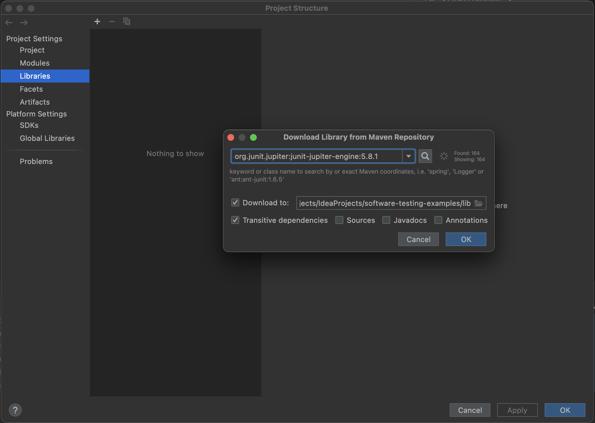

# Software Testing

An educational project to teach students how to test their application code

### Useful links:

- [JUnit 5 User Guide](https://junit.org/junit5/docs/current/user-guide/)
- [Working with JAR libraries in Intellij IDEA](https://www.jetbrains.com/help/idea/library.html)
- [Baeldung - JUnit 5](https://www.baeldung.com/junit-5)
- [Baeldung - Mockito](https://www.baeldung.com/mockito-annotations)
- [Types Of Software Testing](https://www.atlassian.com/continuous-delivery/software-testing/types-of-software-testing)
- [Clean Code With Unit Tests](https://betterprogramming.pub/clean-code-with-unit-tests-5f28020828a5)

### Adding testing libraries

File -> Project Structure ->

JUnit 5 dependency ->

Mockito dependency ->

